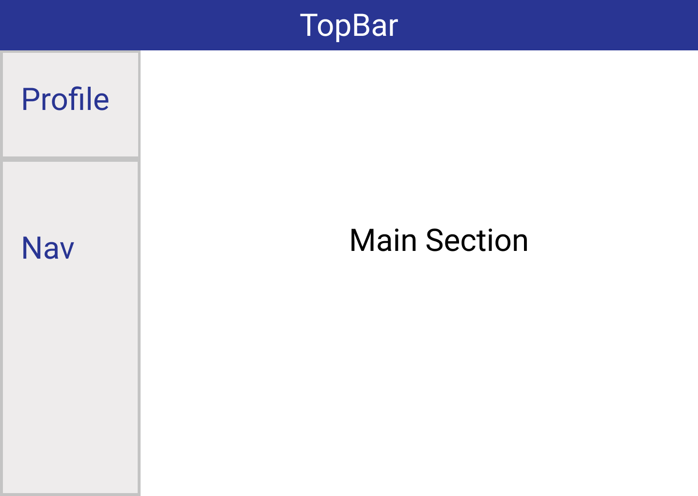
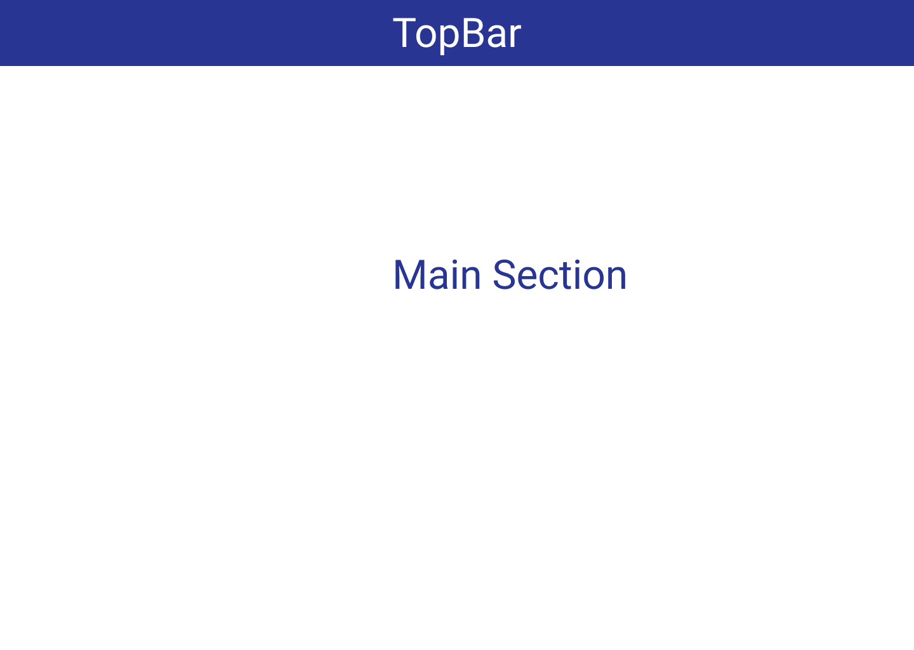

# React Material UI Dashboard Boilerplate

This boilerplate provides minimal functionality of a dashboard to be developed in React and Material UI. Here is how it looks [DEMO](https://react-mui-dashboard-boilerplate.netlify.app)

> **_NOTE:_** This Repo is still under development. I will be updating time to time. Keep with pace.

## Layouts
For this repository two basic layouts have been implemented such as;
1.  Main Layout
2.  Minimal Layout

### Main Layout 
This is main layout for dashboard which contains TopBar on Top with Full Width. Below that We have two main sections such as Sidebar and main section.



Many other variations of the layouts is possible, which you can make for your own requirements.

### Minimal Layout 

This Layout contains TopBar and Main Section. However, based on your requirement you can remove TopBar and can be left with Main Section only. This Layout can be used for unprotected routes such as Signup, Signin and not found pages. 



## Views
So far below views has been added, which i think are part of boilerplat for which any developer getting started with dashboard should not re-develop each time.

    1.  Dashboard (At the moment with StatCard component only. Will add chart based components in near future)
    2.  Signup
    3.  Login 
    4.  Reset Password
    5.  Not Found Page

## Global Theme 

For this boilerplate i have choosen below paletter, however you can alter color palette as per your own requirement. Here is complete list of color palette in Material UI  ==> [MUI color palette](https://material-ui.com/customization/color/#color)

### Color Palette

You can find color palette.js in theme directory.

#### Primary 
    primary: {
        contrastText: white,
        dark: colors.indigo[900],
        main: colors.indigo[800],
        light: colors.indigo[100]
    },
#### Secondary 
    secondary: {
        contrastText: white,
        dark: colors.deepPurple[900],
        main: colors.deepPurple[800],
        light: colors.deepPurple[100]
    },
#### Success 
    success: {
        contrastText: white,
        dark: colors.green[900],
        main: colors.green[800],
        light: colors.green[100]
    },
and others ..
## Components

    ... To be updated

## API (Backend)

    ... To be updated

## How to Use ?

Clone repository and install dependencies and get started

```
npm install & npm start
```

Since, development is going on, anytime you can get latest changes by;
```
git pull
```

## Contribution

This boilerplate may not be absolute minimal for all environment or design requirements. I encourage your views and contributions into this repo to make development easy for all.

If you want to contribute for layout, design, theme and components, please clone the repository, create your branch and make pull request upon completion of your code changes. It shall be added to main boilerplate repository for greater good.
